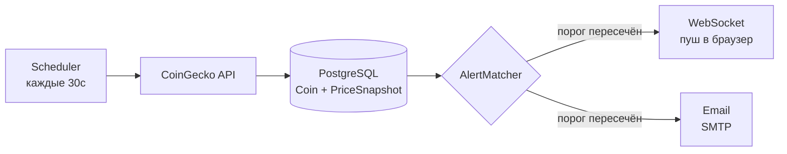

# CryptoTracker

Веб-приложение для мониторинга криптовалютного рынка.

Сервис позволяет отслеживать актуальные цены криптовалют, настраивать персональные ценовые алерты, вести портфель активов и список наблюдения. Приложение построено на стеке Java + Spring Boot, использует PostgreSQL как основное хранилище и Redis для кэширования.

**Фоновый цикл обновления цен**

## Функциональность

**Актуальные цены**
Планировщик каждые 30 секунд опрашивает CoinGecko API по ключу через OkHttp-клиент. Цены сохраняются в БД (текущее значение в `Coin` + история в `PriceSnapshot`). 

**Обновление цен в реальном времени**
На страницах фронта JS подключается к WebSocket (STOMP) и периодически опрашивает AJAX-эндпоинты (`/api/ui/prices`), обновляя цены без перезагрузки страницы. Шаблоны - FreeMarker.

**Ценовые алерты**
Пользователь задаёт монету, целевую цену и направление (выше / ниже). После каждого обновления цен `AlertMatcher` проверяет все активные алерты и фиксирует срабатывание, если порог пересечён.

**Уведомления**
При срабатывании алерта создаётся запись в таблице `Notification`, алерт переходит в статус `TRIGGERED`. В зависимости от выбранного канала пользователь получает push-уведомление через WebSocket (`/queue/notifications`) и/или письмо на email (Spring Mail + Yandex SMTP).

**Портфель (Portfolio)**
Пользователь добавляет монеты с количеством и ценой покупки. Сервис считает текущую стоимость позиции и прибыль/убыток на основе актуальной цены из БД.

**Список наблюдения (Watchlist)**
Пользователь добавляет монеты в вотчлист для быстрого доступа к их ценам на главной странице.

**Аутентификация и авторизация**
Spring Security с form-login, BCrypt, Remember-Me на 14 дней, CSRF через cookie. Роли: `USER` и `ADMIN`. Администратор управляет списком монет через отдельный раздел.

**REST API**
Все алерты доступны через REST (`/api/alerts`). Документация - Swagger UI по адресу `/swagger-ui.html`.
